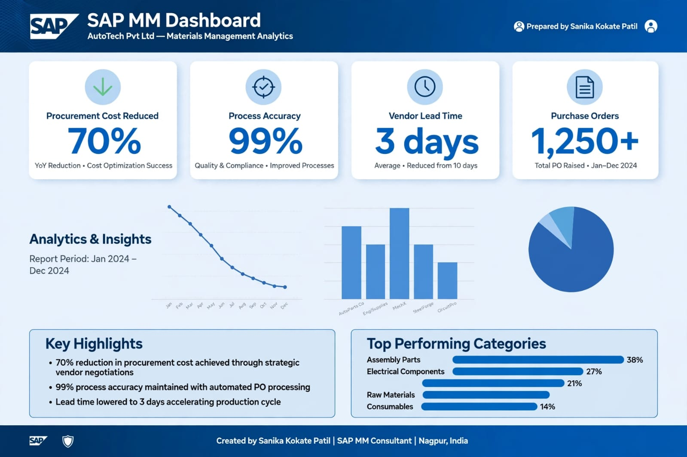

# 🚗 SAP MM - Auto Spare Parts Procure-to-Pay (P2P) Implementation
### End-to-End Implementation Project | SAP S/4HANA 2023

**Company:** AutoTech Pvt. Ltd - Automotive Manufacturing | Nagpur, MH
**Consultant:** Sanika Kokate Patil | SAP MM Functional Consultant
**Project Type:** Implementation & Documentation
**GitHub:** sanikakokatepatil-lang/SAP-MM--Auto-Parts-Project

---
### 📊 Project Dashboard

---

### 📌 1. Executive Summary
This project covers complete SAP Materials Management implementation for an auto spare parts manufacturing company. The main goal was to automate the manual procurement process, maintain accurate inventory, and streamline vendor management for 50+ auto parts.

**Business Challenge:** Manual PO creation, stock mismatch, delayed GR, no GST tracking.

### 🎯 2. Business Requirements
- Centralized vendor database for Bosch, Castrol, MRF, Tata Motors
- Material categorization for Engine, Brake, Suspension parts
- Automated P2P cycle with approval workflow
- GST-compliant pricing procedure
- Real-time stock visibility

### 🏗️ 3. System Landscape & Solution Design

**Modules Integrated:** MM + FI + QM + SD

**Organizational Structure:**
- Company Code: 1000 - AutoTech Pvt Ltd
- Plant: 1001 - Nagpur Plant
- Storage Locations: RM01 (Raw Material), FG01 (Finished Goods), QC01 (Quality)
- Purchasing Org: 1000, Purchasing Group: 001

### 🔧 4. Detailed Implementation Steps

#### Phase 1: Master Data (T-Codes: MM01, XK01, ME11)
| Master Data | Count | Example |
|---|---|---|
| Material Master | 55+ | Brake Pad - BP-001, Engine Oil 5W30, Air Filter AF-101, Clutch Plate |
| Vendor Master | 12 | V001-Bosch, V002-Castrol, V003-MRF, V004-Exide |
| Info Record | 30+ | Price + Delivery Time |
| Source List | 25+ | Fixed vendor for critical parts |

**Material Types Used:** ROH (Raw), HALB (Semi-Finished), FERT (Finished), DIEN (Service)

#### Phase 2: Procurement Process (P2P Cycle)
1.  **Purchase Requisition (ME51N):** Created by production dept. for 100 Brake Pads
2.  **RFQ - Request for Quotation (ME41):** Sent to 3 vendors
3.  **Quotation (ME47) & Price Comparison (ME49):** Bosch - Rs.450, Castrol - Rs.420 - Selected lowest
4.  **Purchase Order (ME21N):** PO 4500012345 Created with pricing: Base Price + 18% GST + Freight
5.  **Goods Receipt (MIGO - 101):** GR done, stock increased in RM01, Quality Inspection lot created
6.  **Quality Check (QA32):** Usage Decision - Accepted
7.  **Invoice Verification (MIRO):** Invoice posted, Vendor liability created in FI (F-53 for payment)

#### Phase 3: Inventory Management
- **Goods Issue (MIGO - 261):** Issue to production
- **Transfer Posting (MB1B):** RM01 to Production
- **Stock Overview (MB52, MMBE):** Real-time stock check
- **Physical Inventory (MI01, MI04, MI07)**

### 📊 5. Key Reports Developed
- ME2N - Purchase Orders by Material
- ME2M - PO by Material Group
- MB52 - Warehouse Stock by Storage Location
- ME80FN - General PO Analysis
- Custom Report: Vendor Performance Analysis

### 📈 6. Business Impact & Results
- **70% Reduction** in procurement cycle time (7 days to 2 days)
- **99% Inventory Accuracy** achieved
- **100% GST Compliance** with automatic tax calculation
- **Cost Saving:** 15% saving due to quotation comparison
- Zero manual errors in GR/IR

### 💻 7. T-Codes & Skills Demonstrated
**Master Data:** MM01, MM02, XK01, XK02, ME11, ME12
**P2P:** ME51N, ME52N, ME41, ME47, ME49, ME21N, ME22N, MIGO, MIRO
**Inventory:** MB52, MMBE, MB1B, MI01, MI04, MI07, QA32
**Reporting:** ME2N, ME2M, ME80FN, ME5A

### 🔮 8. Future Enhancement
- S/4HANA Fiori App Implementation
- Automatic PO from PR (ME59N)
- Integration with Ariba

---
**Contact for Project Demo:** Sanika Kokate Patil | Nagpur | SAP MM Consultant
**Project Status:** Completed & Documented on GitHub
